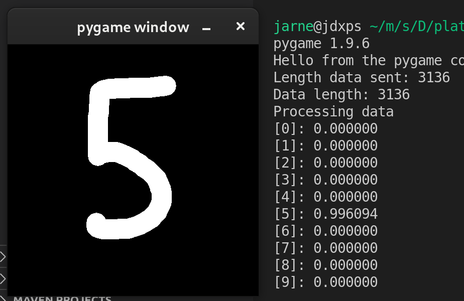

# Demo TFLite Platformio

In this demo you will run a digit classifier on the ESP32. 

This demo consists of two programs, the classifier code for the ESP32 (the platformio code) and the Python code to interface with the ESP32 (`demo.py`). 

> ⚠️ This demo is intended for Linux, it is possible it may also work on Windows but this has not been tested.



## Requirements

- NumPy
- OpenCV
- Pygame

## Installation

1. Install [PlatfromIO IDE for VSCode](https://platformio.org/platformio-ide) (or any other IDE of your liking).

1. Change the upload port in `platformio.ini`.
    ```ini
    upload_port = /dev/ttyUSB0
    ```
    > To view available serial ports run `ls -l /dev/ttyUSB*`

1. Press the upload button on the bottom bar (VSCode).

1. Change the port in the Python script to the same port.
    ```python
    # Serial
    port = '/dev/ttyUSB0'
    ```

## Usage

1. Make sure the ESP32 is connected to your pc/laptop.

1. Run the Python script, it should automatically connect to the ESP via a serial connection.
    ```
    python demo.py
    ```

1. A blank window should open in which you can draw a number.

1. Press 's' to send the drawing to the ESP32.

1. The ESP will respond with the predictions in the console.

### Controls

- **s** - Send the drawing to the ESP32

- **c** - Clear the screen

- **q** - Quit the program